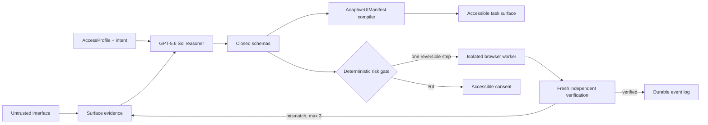

# MORPH

> **Any interface. Any body. One intent.**

MORPH is a user-controlled accessibility runtime that converts a hostile or inaccessible interface into a task-specific adaptive surface, operates the original interface one bounded step at a time, and verifies fresh evidence after every action.

It is not a chat wrapper, an accessibility overlay, or a WCAG conformance claim. MORPH changes the unit of interaction from *page navigation* to *verified human intent*.

- **Build Week track:** Apps for Your Life
- **Frozen demonstration:** safe travel rebooking for low vision, one-switch motor access, and cognitive-load reduction
- **Live application:** `<LIVE_APP_URL>`
- **Demo portal:** `<LIVE_DEMO_PORTAL_URL>`
- **Three-minute video:** `<DEMO_VIDEO_URL>`
- **Source repository:** `<REPOSITORY_URL>`

## The five-second proof

The demo opens on the same travel task in two worlds. On the left is an intentionally chaotic booking portal with five shifting layouts. On the right, MORPH compiles the user's constraints into a small, accessible interaction surface while the Agent Observatory exposes Perception, Adaptive Design, Planner, Critic, execution, and verification evidence in real time.

Select **Mutate source UI**. The original date control changes underneath an existing plan. MORPH detects the verification mismatch, rejects stale evidence, rewinds to CAPTURE, re-runs perception, and produces a page-version-bound plan without losing the user's budget or consent constraints.



## Judging criteria

### 1. Technological Implementation

MORPH uses the 2026 OpenAI stack where model intelligence is valuable and deterministic code where authority matters.

**Responses API reasoning plane.** `@morph/agents` calls `client.responses.create`, targets `gpt-5.6-sol`, and requests `reasoning: { effort: "high" }`. It preserves returned output and encrypted reasoning items across browser mutations with bounded `reasoning.context`, while `store: false` prevents model context from becoming the workflow database. Three explicit prompt-cache breakpoints isolate the stable safety constitution, closed `AccessProfile` contract, and adaptive UI grammar.

**Programmatic Tool Calling.** The DOM and accessibility tree never enter the prompt as an unbounded dump. Two strict client-owned tools expose bounded structural records and opt in with `allowed_callers: ["programmatic"]`, alongside the `programmatic_tool_calling` hosted tool. Only code executing inside the isolated V8 program can invoke those tools; direct calls are rejected, arguments and outputs are Zod-validated, and every round is capped.

**Closed multi-agent orchestration.** The application routes five schema-scoped outputs through Root, Perception, Adaptive Design, Planner, and Critic roles. Specialist routing is feature-flagged and bounded; the deterministic state machine remains the outer controller. Model output cannot enter application state until both Responses Structured Outputs and the local Zod schema accept it.

**Codex Adapter Forge.** A failed adapter route activates a server-side `@openai/codex-sdk` specialist. MORPH creates a redacted ephemeral workspace containing only the target fixture, the `Adapter` contract, and allowlisted runtime primitives. Codex runs with workspace-write isolation, network disabled, bounded time, and one output path. Generated TypeScript must pass AST policy, VM, unit, Playwright, axe-core, and target-integrity gates. The pipeline permits three attempts, hashes and Ed25519-signs verified source, and stores the artifact with its pgvector embedding. If live generation fails, the same gates run against a pinned prebuilt adapter; failure of both paths stops safely.

**Durable, inspectable execution.** PostgreSQL's append-only `session_events` log is the authority. The lifecycle is reconstructed as `CAPTURE → NORMALIZE → ROUTE → PARALLEL_REASON → COMPILE → SIMULATE → RISK_GATE → EXECUTE_ONE_STEP → VERIFY`. The SSE Observatory projects an allowlisted view of state changes, candidate plans, rejected hypotheses, tool activity, and evidence—never private chain-of-thought.

Relevant OpenAI references: [GPT-5.6 guidance](https://developers.openai.com/api/docs/guides/latest-model), [Programmatic Tool Calling](https://developers.openai.com/api/docs/guides/tools-programmatic-tool-calling), [Responses multi-agent](https://developers.openai.com/api/docs/guides/responses-multi-agent), and [Codex SDK](https://developers.openai.com/codex/sdk).

### 2. Design

The central design primitive is not a component chosen by a model. It is a closed, versioned `AdaptiveUIManifest` compiled into a coherent interaction system.

The recursive compiler validates the manifest and `AccessProfile`, proves that every parent exists, permits children only beneath `GROUP` nodes, rejects cycles and unreachable components, requires enabled actions in the declared focus order, and stops safely if the manifest/profile identifiers diverge. It then maps only the allowlisted grammar—`AdaptiveText`, `AdaptiveList`, `AdaptiveButton`, and `AdaptiveModal`—to semantic React.

One manifest becomes three materially different presentations without changing the user's intent:

- **Low Vision:** 200% scalable type, dark high contrast, large targets, reduced motion, and semantic announcements.
- **One-Switch Motor:** deterministic focus order, automatic sequential scanning, 72-pixel minimum targets, and keyboard/switch activation.
- **Cognitive Load Reduction:** plain language, one decision at a time, aggressive whitespace, and no more than three choices.

Every compiled action emits a typed `AdaptiveExecutionIntent` back to `RISK_GATE`; rendering grants no browser authority. The split-screen source/runtime comparison, constraint ledger, animated agent constellation, verification timeline, and visible replay/live badge form one product experience rather than a collection of diagnostics.

### 3. Potential Impact

The World Health Organization estimates that **1.3 billion people—one in six people globally—experience significant disability**. Yet accessibility is still delivered mainly site by site, long after products ship, and users must repeatedly adapt themselves to different navigation, timing, language, and motor assumptions.

MORPH proposes a user-edge runtime model: a person carries an access profile, intent, consent policy, and interaction modality across interfaces. The immediate Build Week proof is travel disruption, where inaccessible, time-sensitive recovery can strand a passenger. The same architecture could extend—only after domain-specific safety work—to public services, education, commerce, workplace tools, and essential utilities.

The scale comes from changing who owns adaptation. Instead of waiting for every application vendor to rebuild every flow for every body, a verified runtime can compile the task at the user's edge while still operating the source of truth. MORPH is assistive software; it complements source remediation and does not certify third-party accessibility.

Source: [WHO disability fact sheet](https://www.who.int/news-room/fact-sheets/detail/disability-and-health).

### 4. Quality of the Idea

Legacy overlays try to patch a page after it was designed. MORPH does not repair the page. It replaces the page as the user's primary task surface.

That is the zero-to-one shift:

1. **From visual patching to intent compilation.** MORPH generates the smallest interface needed for the current goal and person.
2. **From hidden automation to evidence choreography.** Judges and users can see what was perceived, rejected, executed, and verified without exposing private reasoning.
3. **From model autonomy to governed agency.** Models propose typed artifacts; deterministic risk, consent, idempotency, and verification gates decide whether the world may change.
4. **From brittle scripts to repairable adapters.** Verified adapters can be generated, tested, signed, semantically routed, and safely replaced when a site mutates.
5. **From one accessibility mode to a portable user edge.** The same intent recompiles across vision, motor, and cognitive profiles.

For task completion, this architecture makes the legacy overlay abstraction obsolete: the user no longer needs a patched replica of every inaccessible page. It does **not** make standards, accessible source code, usability research, or vendor accountability obsolete; those remain necessary.

## Safety architecture

| Boundary | Enforced control |
| --- | --- |
| Page → model | DOM, accessibility labels, images, and tool outputs are untrusted evidence, never instructions. |
| Model → state | Closed Structured Outputs plus local Zod parsing; unknown fields fail closed. |
| Plan → execution | Shared command/risk classification, simulation, page-version binding, and deterministic `RISK_GATE`. |
| Reversible action | Execute exactly one step, capture fresh state, and verify before continuing. |
| Irreversible R4 action | Fresh, accessible, action-specific consent; mutation expires prior consent. |
| Verification mismatch | Re-observe and replan at most three times, then `STOP_SAFE`. |
| Codex → adapter registry | Redacted no-network workspace, one output path, independent tests, SHA-256 hash, Ed25519 signature. |
| Event log → browser | Strict public projection; no raw screenshots, secrets, personal data, raw model output, or chain-of-thought. |

The Build Week target is synthetic. It performs no real purchase, uses no passenger or payment data, and makes no WCAG conformance claim.

## Reproducible evidence

Phase 9 freezes a deterministic `5 layouts × 3 access profiles × 2 intents` matrix:

| Metric | Frozen result |
| --- | ---: |
| Scenarios | 30 |
| Task completion | 100% |
| Constraint satisfaction | 100% |
| Adaptive-surface violations | 0 |
| Total retries | 12 |
| Median / p95 simulated latency | 1,652 / 2,139 ms |
| Estimated tokens | 106,760 |
| Unconsented irreversible actions | **0** |

Latency and token cost are deterministic estimates, not production telemetry. The build fails if unconsented irreversible actions exceed zero.

## Test from scratch

### Prerequisites

- Node.js 24 recommended; `>=22.13.0` required
- npm 10 or newer
- Git
- Chromium installed through Playwright for browser and axe-core gates
- PostgreSQL with pgvector only for authenticated live SSE; it is not required for the judge replay

### 1. Clone and install

```bash
git clone <REPOSITORY_URL> morph
cd morph
npm ci
npx playwright install chromium
```

On Linux CI, install the browser and OS libraries together:

```bash
npx playwright install --with-deps chromium
```

### 2. Create the local environment

macOS/Linux:

```bash
cp .env.example .env.local
```

PowerShell:

```powershell
Copy-Item .env.example .env.local
```

The checked-in defaults are safe: replay mode, no real transaction, no live Codex generation, and a three-replan limit. Leave secrets empty for the deterministic judge path.

### 3. Run the release gates

```bash
npm run check
```

The gate runs lint, root plus workspace typechecks, the fatal 30-case eval, unit and integration suites, real Playwright/axe checks, application builds, and rendered-shell assertions. GitHub Actions runs this on Ubuntu with real Chromium. Some managed Windows sandboxes deny child-process creation with `spawn EPERM`; that is documented as environment-blocked, never treated as a passing browser result.

Useful narrow commands:

```bash
npm run lint
npm run typecheck
npm run eval
npm run health
```

### 4. Start the two-pane demo

Terminal 1—the intentionally inaccessible source portal:

```bash
npm run dev:portal
```

Terminal 2—the MORPH runtime:

```bash
npm run dev
```

Open `http://127.0.0.1:3000`. The source portal runs at `http://127.0.0.1:4173`.

## Judge-safe deterministic fallback

Use this when network access, model entitlement, PostgreSQL, or Codex generation is unavailable.

1. Keep these values in `.env.local`:

   ```dotenv
   MORPH_DEMO_MODE=replay
   NEXT_PUBLIC_MORPH_OBSERVATORY_MODE=replay
   MORPH_MULTI_AGENT_ENABLED=false
   CODEX_ADAPTER_FORGE_ENABLED=false
   MORPH_REQUIRE_CONSENT=true
   MORPH_MAX_REPLANS=3
   ```

2. Start the portal and MORPH with the two commands above.
3. Confirm the Observatory badge says **Labeled judge replay**. A replay must never be described as a live GPT-5.6 Sol call.
4. Choose **One-Switch Motor** to see deterministic sequential scanning, then switch to **Low Vision** or **Cognitive Load Reduction** to recompile the same intent.
5. Select **Mutate source UI**. The source swaps its date control, and the identical public event schema renders `VERIFICATION_MISMATCH → CAPTURE → PERCEPTION → PARALLEL_REASON → COMPILE`.
6. Run `npm run eval` to reproduce all 30 cases and the zero-unconsented-R4 build invariant.
7. Optional: `npm test --workspace @morph/adapter-forge` exercises the bounded repair, prebuilt fallback, and stop-safe paths with real browser gates.

To inspect an adversarial portal fixture directly, open:

```text
http://127.0.0.1:4173/?variant=0&attack=hidden-expensive-flight
```

The injected hidden text is deliberately invisible and untrusted. Its rejection is proven by `packages/evals/src/red-team.test.ts`.

## Live mode

Live Observatory mode requires a seeded PostgreSQL/pgvector database, a real demo session, exact web origin, a 32-character-or-longer stream credential, and the orchestrator service. A live Sol call additionally requires `OPENAI_API_KEY`; live Adapter Forge requires Codex credentials and an Ed25519 signing key. Never put those values in the client bundle or commit them.

Set `NEXT_PUBLIC_MORPH_OBSERVATORY_MODE=live` only when those dependencies are available. The UI keeps the live/replay distinction visible.

## Repository map

```text
app/                         Sites-compatible MORPH web runtime
apps/demo-portal/            five-variant inaccessible travel fixture
apps/orchestrator/           durable workflow and authenticated SSE projection
apps/browser-worker/         isolated Playwright capture, one-step execution, verification
apps/adapter-forge/          server-side Codex generation, repair, tests, signed publication
packages/contracts/          strict TypeScript and Zod domain contracts
packages/agents/             GPT-5.6 Sol Responses client, prompts, routing, programmatic tools
packages/state-machine/      append-only replay and deterministic safety governor
packages/accessibility-kit/  constrained accessible component grammar
packages/evals/              30-case matrix and adversarial red team
db/ and drizzle/             PostgreSQL, pgvector, indexes, migrations
docs/                        product, threat model, ADRs, demo script, submission copy, ledger
```

## Known boundaries

- MORPH is proven against a synthetic travel portal, not arbitrary production websites.
- The three profiles are strong demonstration presets, not a complete representation of individual access needs.
- Automated accessibility tests cannot replace research with people who use assistive technology.
- The native Responses multi-agent API remains beta; MORPH's application-managed specialist routing is feature-flagged and deterministic at the outer boundary.
- Real-world travel, healthcare, financial, legal, or identity-bearing execution remains disabled.

## Submission assets

- [Three-minute demo script](docs/demo-script.md)
- [Devpost submission copy](docs/devpost-submission.md)
- [Architecture](docs/architecture.md)
- [Threat model](docs/threat-model.md)
- [Evaluation and CI evidence](docs/build-ledger.md)
- [Architecture decisions](docs/decisions.md)

## Status

Phases 0–10 are frozen for Build Week submission packaging. No Phase 11 work has begun.