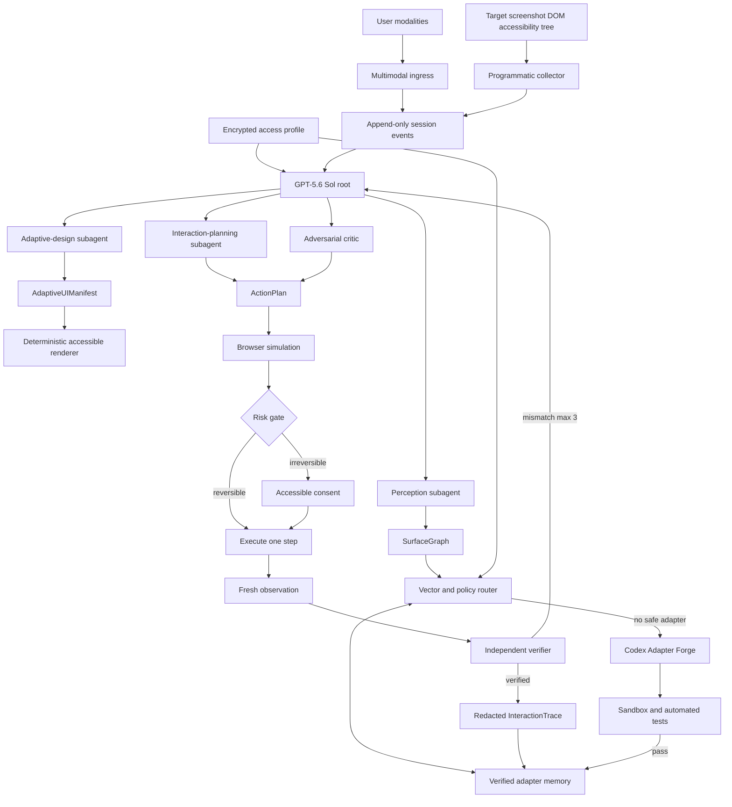

# MORPH technical architecture

- Status: **FROZEN for Build Week v0.1**
- Frozen: 2026-07-14
- Architectural style: event-sourced deterministic workflow with bounded model reasoning

## 1. System invariants

1. Durable application state belongs to an append-only event store, never to model context.
2. The outer workflow is deterministic code. Models propose typed artifacts within bounded states.
3. Page content is untrusted data and cannot issue instructions or expand tool authority.
4. Every external side effect crosses a risk gate.
5. Every irreversible side effect requires fresh, action-specific user consent.
6. Every executed step is followed by fresh observation and independent verification.
7. Model output is invalid until a closed schema and policy validator accept it.
8. No user-facing surface displays private chain-of-thought.

## 2. Runtime map



## 3. Deterministic state machine

```text
CAPTURE
  -> NORMALIZE
  -> ROUTE
  -> PARALLEL_REASON
  -> COMPILE
  -> SIMULATE
  -> RISK_GATE
  -> EXECUTE_ONE_STEP
  -> VERIFY
       -> NEXT_STEP
       -> COMPLETE
       -> REPLAN (maximum 3)
       -> ASK_USER
       -> REQUIRE_CONSENT
       -> STOP_SAFE
```

Each transition consumes an immutable event version and emits a new event. Commands use idempotency keys. A stale command cannot execute against a newer page version.

## 4. Agent boundaries

### Root reasoner

Owns task decomposition, synthesis, ambiguity detection, and stopping. It cannot write directly to the browser or database.

### Perception subagent

Reconciles screenshot, DOM, accessibility-tree, and page-state evidence into a `SurfaceGraph`. It reports contradictions explicitly.

### Adaptive-design subagent

Compiles the current task and profile into an `AdaptiveUIManifest` using an allowlisted component grammar.

### Interaction-planning subagent

Produces candidate action paths with preconditions, expected postconditions, reversibility, risk class, evidence requirements, and compensation actions.

### Adversarial critic

Searches for prompt injection, hidden state, unsupported assumptions, constraint violations, confusing consent, and accidental add-ons.

### Independent verifier

Receives fresh evidence and expected postconditions. It does not inherit the executor's confidence or success claim.

### Deterministic safety governor

Classifies action risk, enforces allowlists, validates consent freshness, rate-limits retries, and stops on policy violations. It is not an LLM.

## 5. OpenAI capability contract

The critical reasoning model is `gpt-5.6-sol` through the Responses API.

Planned capabilities:

- image input with original detail for interface evidence
- structured outputs for every domain artifact
- persisted reasoning across ordered browser steps
- explicit prompt caching for stable policy and UI grammar
- Multi-agent beta for bounded independent perception, design, planning, and criticism
- Programmatic Tool Calling for predictable collection, filtering, ranking, and validation
- direct function or computer-use calls for approval-sensitive actions
- streaming events for the Agent Observatory

Current feature references:

- https://developers.openai.com/api/docs/guides/latest-model
- https://developers.openai.com/api/docs/models/gpt-5.6-sol
- https://developers.openai.com/api/docs/guides/responses-multi-agent
- https://developers.openai.com/api/docs/guides/tools-programmatic-tool-calling

The runtime must provide a labelled deterministic replay mode because Multi-agent is beta and judge environments may lack identical availability. Replay cannot be presented as a live model call.

## 6. Codex boundary

Codex is both the implementation environment and, in Phase 7, a coding specialist inside the Adapter Forge. It receives a redacted fixture, adapter interface, allowed primitives, and tests; it works in an ephemeral workspace and may publish only an artifact that passes unit, browser, accessibility, and policy checks.

Reference: https://learn.chatgpt.com/docs/codex-sdk

Codex does not run inside the end user's browser and cannot bypass the safety governor.

## 7. Vector routing

The router embeds a normalized tuple of domain fingerprint, SurfaceGraph, task family, access-profile capabilities, and locale. Candidate adapters are ranked by semantic similarity, structural match, historical task success, accessibility score, and recency, with failure and safety penalties.

Similarity is retrieval, not authorization. Every candidate must pass deterministic applicability checks and a dry replay against the current page version.

## 8. Planned data model

Phase 2 will define migrations and closed schemas for:

- `access_profiles`
- `sessions`
- `session_events`
- `surface_graphs`
- `intent_graphs`
- `ui_manifests`
- `action_plans`
- `action_steps`
- `verifications`
- `consent_records`
- `agent_runs`
- `adapters`
- `adapter_versions`
- `interaction_traces`
- `eval_cases`
- `eval_results`

PostgreSQL with pgvector is the planned authoritative store. Sites D1 remains disabled because it is not suitable as the canonical vector-backed event store for the frozen architecture. A later deployment may add a narrowly scoped D1 cache only through a new decision record.

## 9. Repository topology

```text
repo root             @morph/web and OpenAI Sites/vinext surface
apps/orchestrator     durable workflow and future Responses API gateway
apps/browser-worker   isolated observation and browser execution
apps/adapter-forge    future Codex SDK specialist
packages/contracts    closed domain schemas and types
packages/agents       prompts, model policies, and tool contracts
packages/state-machine deterministic transitions and invariants
packages/accessibility-kit adaptive component grammar
packages/browser-tools typed browser observation and action tools
packages/evals        scenario generators and graders
packages/telemetry    safe traces, events, and measurements
infra                 future migrations, seeds, and deployment declarations
```

The web package remains at the root to preserve the Sites-compatible vinext build. npm workspaces provide the monorepo boundary for all other packages.

## 10. Event streaming

The orchestrator will write typed events before streaming them over SSE. The browser may reconnect using the last event identifier and reconstruct visible state from durable events. Streamed content contains concise summaries and evidence references, not hidden reasoning.

## 11. Failure behavior

- Invalid model object: reject and request one repair; then stop safely.
- Tool timeout: record failure and retry only when idempotent.
- Target mutation: invalidate stale plan, re-observe, and replan.
- Consent state mutation: expire consent and ask again.
- Verification mismatch: replan with evidence delta, maximum three attempts.
- Model unavailable: offer labelled replay or stop; never synthesize success.
- Browser unavailable: preserve intent and evidence, then stop without side effects.
- Adapter tests fail: quarantine artifact; never publish it.

## 12. Phase 1 implementation boundary

Phase 1 contains executable package health checks, CI, environment contracts, and a product-specific web shell. It does not yet contain production schemas, OpenAI calls, browser automation, generated adapters, or persistent state.

## 13. Phase 6 adaptive compiler

The web runtime reparses both AdaptiveUIManifest and AccessProfile, validates graph topology, and recursively emits only the constrained accessibility-kit grammar.

AdaptiveUIManifest + AccessProfile -> closed Zod parse -> graph and focus validation -> deterministic recursive compiler -> semantic accessible components -> AdaptiveExecutionIntent -> RISK_GATE -> EXECUTE_ONE_STEP or REQUIRE_CONSENT.

Rendering is not an authority boundary. A UI selection carries an ActionStep identifier into the state machine; only the durable risk gate may authorize the browser worker. One-switch focus order comes from the manifest and scan timing comes from the AccessProfile. Cognitive-load choice count and presentation are enforced by deterministic code.